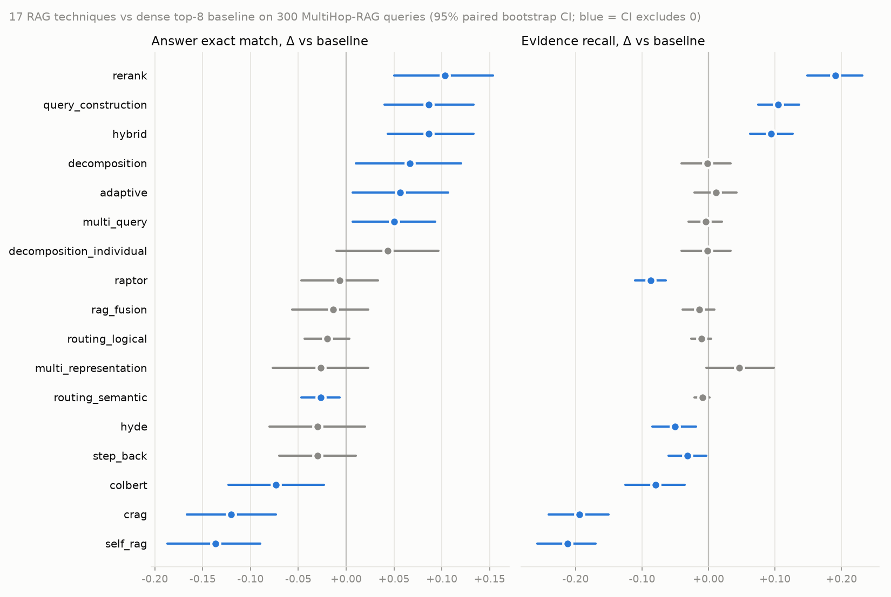

# rag-from-scratch

Every technique from LangChain's *RAG From Scratch* course, rebuilt in plain Python with no
framework and benchmarked head to head on 300 MultiHop-RAG questions, to measure which ones
actually help and by how much.



### Highlights
- **Cross-encoder reranking is the clear winner:** +10.3 points of exact match over dense top-8
  retrieval (0.563 → 0.667, 95% CI of the gain +5.0 to +15.3) and +19.1 points of evidence recall.
  It still makes one LLM call per question.
- **Cheap retrieval fixes beat LLM query rewriting.** Hybrid BM25+dense (+8.7) and metadata-filtered
  search (+8.7) each cost at most one extra call. Multi-query, RAG-Fusion, HyDE and step-back
  rewrites land between -3.0 and +5.0.
- **Self-correcting loops backfire on multi-hop questions.** CRAG (-12.0) and Self-RAG (-13.7) grade
  each chunk against the whole question, keep only about 2 of 8 chunks, and lose 19-21 points of
  evidence recall while making 16-25 LLM calls per question.
- 18 techniques (a dense baseline and 17 variants) on one local stack (Ollama + an RTX 4090), with
  paired bootstrap confidence intervals on every comparison against the baseline.

**Python · NumPy · PyTorch · Ollama (gemma4 8B, nomic-embed-text) · ColBERTv2 · bge-reranker-v2-m3**

## Results

300 MultiHop-RAG queries (75 each of inference, comparison, temporal and null), generator `gemma4`
8B at temperature 0, top-8 chunks of 1,000 characters. Δ is the paired difference from the
baseline with a 95% bootstrap CI; **bold** means the CI excludes zero.

| technique | lesson | EM | EM Δ vs baseline | evidence recall Δ | LLM calls / q | median latency |
|---|---|---|---|---|---|---|
| rerank (cross-encoder over hybrid top-30) | 15 | **0.667** | **+0.103** [+0.050, +0.153] | **+0.191** | 1.0 | 0.5 s |
| hybrid (dense + BM25, RRF) | extra | 0.650 | **+0.087** [+0.043, +0.133] | **+0.094** | 1.0 | 0.5 s |
| query construction (source/date filters) | 11 | 0.650 | **+0.087** [+0.040, +0.133] | **+0.105** | 2.0 | 1.1 s |
| decomposition (recursive) | 7 | 0.630 | **+0.067** [+0.010, +0.120] | -0.002 | 5.1 | 4.2 s |
| adaptive (route by complexity) | 18 | 0.620 | **+0.057** [+0.007, +0.107] | +0.011 | 5.6 | 3.6 s |
| multi-query | 5 | 0.613 | **+0.050** [+0.007, +0.093] | -0.004 | 2.0 | 3.3 s |
| decomposition (individual) | 7 | 0.607 | +0.043 [-0.010, +0.097] | -0.002 | 5.1 | 3.2 s |
| **baseline** (dense top-8) | 1-4 | 0.563 | — | — | 1.0 | 0.8 s |
| RAPTOR | 13 | 0.557 | -0.007 [-0.047, +0.033] | **-0.087** | 1.0 | 0.5 s |
| RAG-Fusion | 6 | 0.550 | -0.013 [-0.057, +0.023] | -0.014 | 2.0 | 2.2 s |
| logical routing | 10 | 0.543 | -0.020 [-0.043, +0.003] | -0.010 | 2.0 | 1.0 s |
| semantic routing | 10 | 0.537 | **-0.027** [-0.047, -0.007] | -0.009 | 1.0 | 0.5 s |
| multi-representation | 12 | 0.537 | -0.027 [-0.077, +0.023] | +0.046 | 1.0 | 0.8 s |
| step-back | 8 | 0.533 | -0.030 [-0.070, +0.010] | **-0.032** | 2.0 | 1.1 s |
| HyDE | 9 | 0.533 | -0.030 [-0.080, +0.020] | **-0.051** | 2.0 | 1.9 s |
| ColBERTv2 | 14 | 0.490 | **-0.073** [-0.123, -0.023] | **-0.080** | 1.0 | 0.4 s |
| CRAG | 16 | 0.443 | **-0.120** [-0.167, -0.073] | **-0.194** | 16.4 | 6.0 s |
| Self-RAG | 17 | 0.427 | **-0.137** [-0.187, -0.090] | **-0.212** | 25.0 | 9.3 s |

The full tables, with per-type EM, the paper's "contains" accuracy, MRR, all-evidence hit rate, false
refusals and context size, are in [`results/results.md`](results/results.md).
Machine-readable: [`results/summary.json`](results/summary.json).

For scale: answering "Yes" to everything scores 0.287 EM on this sample, and always refusing scores
0.250. Leaving out the 75 unanswerable questions (which every technique refuses correctly
91-100% of the time), the baseline gets 0.418 of answerable questions right and rerank 0.556.

### Reproducibility
I re-ran the headline techniques from scratch with the LLM cache bypassed
(`ragfs eval --no-cache`). The conclusions held:

| technique | EM, published run | EM, cold rerun | Δ vs baseline, cold rerun |
|---|---|---|---|
| baseline | 0.563 | 0.553 | — |
| rerank | 0.667 | 0.667 | **+0.113** [+0.063, +0.167] |
| query construction | 0.650 | 0.643 | **+0.090** [+0.047, +0.137] |
| hybrid | 0.650 | 0.630 | **+0.077** [+0.030, +0.123] |
| CRAG | 0.443 | 0.440 | **-0.113** [-0.157, -0.067] |
| Self-RAG | 0.427 | 0.407 | **-0.147** [-0.190, -0.100] |

Retrieval was bit-identical for every single-shot technique (300/300 queries returned the same
chunks). Generation is not: Ollama at temperature 0 still varies slightly on the GPU, and 1-10% of
answers changed between runs (baseline 269/300 identical, rerank 299/300). Every change stays well
inside the confidence intervals.

## What the numbers say

**Retrieval quality drives the answer.** The three techniques that raise evidence recall
(rerank, query construction, hybrid) are the three biggest EM gains. False refusals fall with them: the baseline refuses 37% of answerable questions and rerank 22%,
consistent with the generator seeing more of the evidence.

**Rewriting the question rarely finds better evidence.** Multi-query, RAG-Fusion and both
decompositions leave evidence recall flat (within ±0.02). HyDE and step-back lower it, since a
hypothetical passage or a more generic question drifts away from the specific outlet and date that
MultiHop-RAG questions name. Decomposition and multi-query still gain EM, but the gain does not come from
better retrieval.

**Metadata beats semantics for routing.** Routing by news category (logical or embedding-based)
barely moves recall, because a question's evidence often spans categories. Extracting the named
outlets and dates and running one filtered search per mention adds +10.5 points of recall for one
extra call.

**Grading chunks one at a time breaks multi-hop retrieval.** A chunk that holds one of a
question's two facts reads as "not relevant" to the whole question. CRAG's grader keeps 2.0 of 8
chunks on average, and Self-RAG runs all 3 of its rounds on 153 of 225 answerable questions. Both lose
roughly half the baseline's evidence and refuse 50-60% of answerable questions.

**The adaptive router has nothing to separate.** It sends 260 of 300 questions down the multi-step
path, because nearly every MultiHop-RAG question cites more than one article. Its result is
essentially recursive decomposition's.

**Summaries crowd out evidence.** RAPTOR's collapsed-tree search returns 3.5 summary nodes in an
average top-8. They are topical but rarely hold the exact fact, so recall drops 8.7 points.
Multi-representation returns whole articles (24k characters of context versus about 6.8k for the
others) and still does not beat the baseline on EM.

**Off-the-shelf ColBERTv2 loses to a modern bi-encoder here.** It was trained on MS MARCO passages.
On 2023 news chunks, `nomic-embed-text` retrieves more of the evidence.

## How it works

```
MultiHop-RAG corpus (609 articles) ──► recursive splitter (1000/200, exact char offsets)
        │                                        │
        │                     ┌──────────────────┼───────────────────┐
        ▼                     ▼                  ▼                   ▼
 article metadata      numpy vector store      BM25 index     ColBERT token index
 (source, date,        (nomic-embed-text)                     / summary + RAPTOR trees
  category)                   │                  │                   │
        └──────────── technique: rewrite / route / filter / fuse / rerank / grade ────┐
                                                                                       ▼
                               gemma4 (Ollama, temp 0) ──► short answer ──► EM, recall, CIs
```

- **Everything is written by hand.** That covers the recursive character splitter, cosine search,
  Okapi BM25, reciprocal rank fusion, GMM clustering for RAPTOR, ColBERT MaxSim scoring, and the
  CRAG and Self-RAG control loops. There is no LangChain, LangGraph, Chroma or colbert-ai.
- **Every LLM call goes through one client** with a disk cache keyed on the full request. Cached reruns are
  free and replay the same answers, and each call records its original duration, so latency stays
  honest on cache hits. `--no-cache` forces fresh calls.
- **Evidence is scored exactly.** Each gold evidence fact (6,084 of them) is located as a character
  span in its article. A retrieved chunk counts as holding it if the chunk covers at least half the
  span, so recall does not depend on fuzzy string matching.
- **Every technique gets the same budget:** 8 chunks, except where the technique by definition
  returns something else (whole articles, summaries). The context size is reported per technique.
- **Index builds are costed separately** from per-query latency. Multi-representation needs 609
  summarisation calls (about 15 minutes) and RAPTOR 617. The ColBERT token index builds in about
  12 seconds on the GPU.

### Differences from the course
- **The corpus is MultiHop-RAG news** (Tang & Yang, 2024), not Lilian Weng's blog, so the results
  can be measured against gold answers and evidence.
- **CRAG falls back to a rewritten query over the corpus**, not Tavily web search, because only the
  corpus is scored.
- **Query construction builds filters from news metadata** (outlet, publication date), not YouTube
  metadata.
- **RAPTOR's first level is one summary per article**, not per cluster of chunks.
- **Self-RAG regenerates deterministically** with a note that its previous answer failed a check,
  instead of resampling.

## Engineering Highlights
- **Implemented 18 techniques (every lesson of the course plus hybrid search) in about 1,800 lines
  of framework-free Python.**
  That includes a recursive splitter, a NumPy vector store, Okapi BM25, reciprocal rank fusion,
  GMM-clustered RAPTOR trees, and CRAG and Self-RAG written as plain control loops instead of
  LangGraph graphs.
- **Built an evaluation harness that scores retrieval exactly.** It locates all 6,084 gold evidence
  facts as character spans, reports paired bootstrap CIs for every technique, and caches LLM calls
  with their original durations, so a resumed run reports the same latency as a cold one. A cold
  rerun with the cache bypassed reproduced every headline result.
- **Showed that a one-call cross-encoder reranker (+10.3 EM) beats 16-25-call agentic loops by
  22-24 points** on multi-hop questions, and traced the loops' losses to per-chunk relevance grading
  that keeps about 2 of 8 chunks.
- **Wrote ColBERTv2 late-interaction search by hand:** a token-level index of 8,314 chunks built in
  about 12 s, with exhaustive MaxSim scoring on the GPU via a segmented `scatter_reduce`.
- **Found and fixed three silent failure modes:**
  - gemma4's default "thinking" mode made each call take about 27 s instead of 0.3 s.
  - Ollama's small default context window would truncate long prompts.
  - Recovering chunk offsets with `str.find` mislocated 21 of 8,314 chunks in articles with repeated
    boilerplate.

## Getting started

Requires Python 3.11+ and [Ollama](https://ollama.com). The ColBERT and rerank techniques use
PyTorch and run much faster on an NVIDIA GPU; everything else only needs Ollama.

```bash
git clone https://github.com/ethanstoner/rag-from-scratch && cd rag-from-scratch
python -m venv venv
source venv/bin/activate            # Windows: venv\Scripts\activate
pip install -e ".[neural,dev]"      # or ".[dev]" to skip torch/transformers
ollama pull gemma4 && ollama pull nomic-embed-text
```

On Windows, `pip install torch` gets a CPU-only build. For the GPU, install torch first with the
command from [pytorch.org](https://pytorch.org/get-started/locally/).

```bash
python -m ragfs list                                        # the 18 techniques
python -m ragfs ask -t rerank "Which company did The Verge and TechCrunch both cover in antitrust stories?"
python -m ragfs eval --techniques baseline,hybrid --per-type 5 --results-dir temp/quick   # quick check
python -m ragfs eval --per-type 75                          # full benchmark (resumable)
python -m ragfs plot                                        # redraw results/deltas.png from summary.json
python -m ragfs eval --no-cache --techniques baseline       # bypass the LLM cache to re-measure latency
python -m ragfs report --results-dir path/to/copy           # rebuild tables from another set of .jsonl files
```

On first use the MultiHop-RAG files (about 12 MB) download from
[Hugging Face](https://huggingface.co/datasets/yixuantt/MultiHopRAG) into `data/multihop/`, and the
first command that needs the index embeds all 8,314 chunks through Ollama (cached in `.cache/`).
Ollama is expected at `http://127.0.0.1:11434`; set `OLLAMA_HOST` if it runs elsewhere, and
`RAGFS_CHAT_MODEL` to try a different generator.

`eval` and `report` write `results.md` and `summary.json` into `--results-dir` (default `results/`).
The per-query `.jsonl` files behind the published numbers are not committed, so run `report` on the
default directory only after an `eval` there, or it will overwrite the published tables with empty
ones. On a 4090 the full 300-query × 18-technique run takes about 4 hours: 3.4 hours of queries,
most of it CRAG and Self-RAG, plus half an hour building the summary indexes.

## Testing

```bash
pytest -q                  # 42 tests
pytest -q -m "not gpu"     # 40 of them; skips the ColBERT/reranker model downloads
```

The tests cover the splitter (size, overlap, exact offsets even when an article repeats itself),
BM25, RRF, the vector store, the metrics and bootstrap, and every technique end to end against a
scripted fake LLM. That includes structured-output failures falling back to plain retrieval, CRAG
keeping only graded-relevant chunks, and Self-RAG giving up after its round cap. They also cover
the CLI's `--no-cache` and `--results-dir` flags. CI (`.github/workflows/tests.yml`) runs the
non-GPU suite on every push, which needs no Ollama, GPU or dataset.

## What I Learned
- **Measure retrieval separately from answers.** Several techniques gained EM without retrieving
  any more evidence, and several agentic ones lost EM because they threw evidence away. A single
  answer-accuracy number would have hidden both.
- **A tutorial's defaults are tuned for its demo.** Per-chunk relevance grading looks sensible on
  single-fact questions over one blog post, and it collapses when the answer is spread across
  several articles.
- **Local models fail quietly.** Thinking mode, context truncation and off-by-a-few-chunks offsets
  all produced plausible output rather than errors. Each one turned up only because something was
  measured.

## Limitations
- **One generator** (gemma4 8B, Q4) **and one embedder.** A stronger model may narrow the gap between
  retrieval strategies, or change the verdict on reasoning-heavy techniques like decomposition.
- **300 queries give confidence intervals about ±5 points wide.** Differences smaller than that
  (for example, among the query-rewriting techniques) are not resolved.
- **Some gold answers have a format EM can't match.** A few comparison and temporal answers are
  words like "Consistent" or "Agreement", which penalises every technique equally.
- **Prompts were written once and not tuned per technique.** A technique's score reflects a
  reasonable implementation, not its ceiling.

## Credits
- **Course:** [RAG From Scratch](https://github.com/langchain-ai/rag-from-scratch) by Lance Martin
  (LangChain). This repo reimplements its ideas and shares no code with it.
- **Dataset:** [MultiHop-RAG](https://github.com/yixuantt/MultiHop-RAG), Tang & Yang 2024, ODC-BY.
- **Models:** [ColBERTv2](https://huggingface.co/colbert-ir/colbertv2.0),
  [bge-reranker-v2-m3](https://huggingface.co/BAAI/bge-reranker-v2-m3).

## License
MIT
